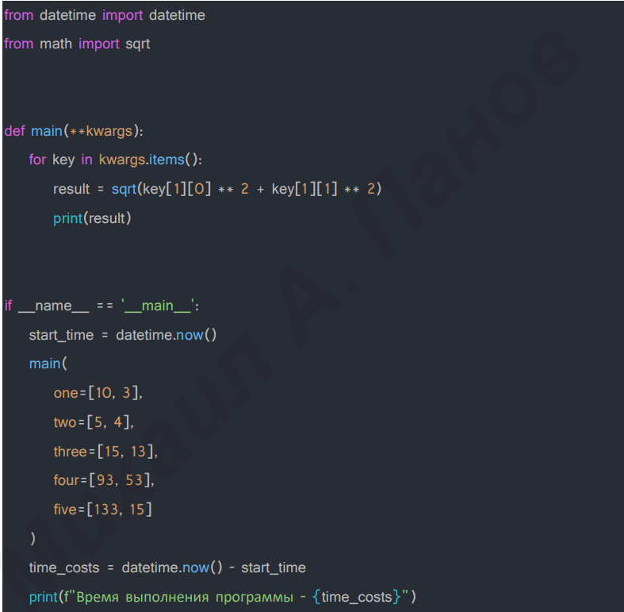
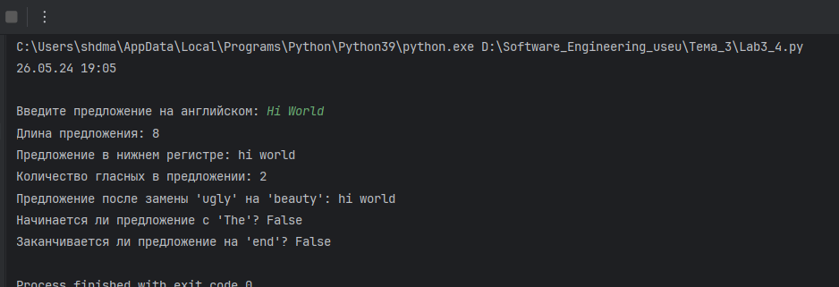
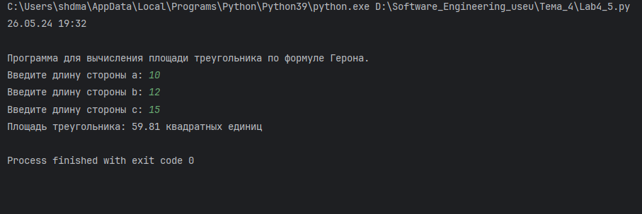

# Тема 4. Функции и модули
Отчет по Теме #4 выполнил:
- Шемякин Дмитрий Андреевич
- ИНО ОЗБ ПОАС-22-1

| Задание    | Сам_раб |
|------------|---------|
| Задание 1  | +       |
| Задание 2  | +       |
| Задание 3  | +       |
| Задание 4  | +       |
| Задание 5  | +       |

знак "+" - задание выполнено; знак "-" - задание не выполнено;

Работу проверили:
- к.э.н., доцент Панов М.А.

## Самостоятельная работа №1
### Дайте подробный комментарий для кода, написанного ниже. Комментарий нужен для каждой строчки кода, нужно описать что она делает. Не забудьте, что функции комментируются по-особенному.


```python
# Импортируем класс datetime из модуля datetime для работы с датами и временем.
from datetime import datetime
# Импортируем функцию sqrt из модуля math для вычисления квадратного корня.
from math import sqrt

def main(**kwargs):
    """
    Вычисляет и выводит длину гипотенузы для пар значений, переданных в виде именованных аргументов.

    Каждый аргумент должен быть списком из двух элементов, представляющих катеты прямоугольного треугольника.
    Функция печатает длину гипотенузы для каждой пары.

    Параметры:
        **kwargs (dict): Словарь, ключи которого - имена аргументов, а значения - списки из двух чисел [a, b].

    Возвращает:
        None. Результаты выводятся на экран.

    Примеры использования:
        main(one=[10, 3], two=[5, 4])
    """
    # Цикл перебора элементов словаря kwargs. Переменная key получает пары (ключ, значение).
    for key in kwargs.items():
        # Вычисление гипотенузы по теореме Пифагора для пары чисел, указанных в списке значения.
        result = sqrt(key[1][0] ** 2 + key[1][1] ** 2)
        # Вывод результата вычисления на экран.
        print(result)

# Проверка, что данный скрипт выполняется как основная программа.
if __name__ == '__main__':
    # Фиксация времени начала выполнения программы.
    start_time = datetime.now()
    # Вызов функции main с передачей именованных аргументов в виде списков с двумя числами.
    main(
        one=[10, 3],
        two=[5, 4],
        three=[15, 13],
        four=[93, 53],
        five=[133, 15]
    )
    # Вычисление времени, затраченного на выполнение программы.
    time_costs = datetime.now() - start_time
    # Вывод на экран затраченного времени в форматированном виде.
    print(f"Время выполнения программы - {time_costs}")

```
### Результат


## Самостоятельная работа №2
### Напишите программу, которая будет заменять игральную кость с 6 гранями. Если значение равно 5 или 6, то в консоль выводится «Выпобедили», если значения 3 или 4, то вы рекурсивно должны вызвать эту же функцию, если значение 1 или 2, то в консоль выводится «Вы проиграли». При этом каждый вызов функции необходимо выводить в консоль значение “кубика”. Для выполнения задания необходимо использовать стандартную библиотеку random. Программу нужно написать, используя одну функцию и “точку входа”

```python
import random

def throw_dice():
    result = random.randint(1, 6)
    print(f"Кубик показывает: {result}")
    if result == 5 or result == 6:
        print("Вы победили!")
    elif result == 3 or result == 4:
        throw_dice()
    elif result == 1 or result == 2:
        print("Вы проиграли!")

if __name__ == "__main__":
    throw_dice()
```
### Результат


## Самостоятельная работа №3
### Напишите программу, которая будет выводить текущее время, с точностью до секунд на протяжении 5 секунд. Программу нужно написать с использованием цикла. Подсказка: необходимо использовать модуль datetime и time, а также вам необходимо как-то “усыплять” программу на 1 секунду.

```python
import datetime
import time

def display_current_time_for_5_seconds():
    end_time = time.time() + 5
    while time.time() < end_time:
        now = datetime.datetime.now()
        print(now.strftime("%d-%m-%Y %H:%M:%S"))
        time.sleep(1)

if __name__ == "__main__":
    display_current_time_for_5_seconds()
```
### Результат


## Самостоятельная работа №4
### Напишите программу, которая считает среднее арифметическое от аргументов вызываемое функции, с условием того, что изначальное количество этих аргументов неизвестно. Программу необходимо реализовать используя одну функцию и “точку входа”

```python
def calculate_average(*args):
    if not args:
        return None
    total = sum(args)
    count = len(args)
    average = total / count
    return average

if __name__ == "__main__":
    print("Среднее арифметическое:", calculate_average(10, 20, 30))
```
### Результат


## Самостоятельная работа №5
### Для реализации задачи создадим два файла Python. Первый файл будет содержать функцию для вычисления площади треугольника по формуле Герона, а второй файл будет использоваться для взаимодействия с пользователем: получения данных о сторонах треугольника и вывода результата.

```python
# triangle_area.py

def heron_area(a, b, c):
    import math
    s = (a + b + c) / 2
    area = math.sqrt(s * (s - a) * (s - b) * (s - c))
    return area

# Lab4_5.py

from triangle_area import heron_area

def get_triangle_sides():
    """Получение сторон треугольника от пользователя."""
    a = float(input("Введите длину стороны a: "))
    b = float(input("Введите длину стороны b: "))
    c = float(input("Введите длину стороны c: "))
    return a, b, c

def main():
    print("Программа для вычисления площади треугольника по формуле Герона.")
    a, b, c = get_triangle_sides()
    area = heron_area(a, b, c)
    print(f"Площадь треугольника: {area:.2f} квадратных единиц")

if __name__ == "__main__":
    main()
```

### Результат
